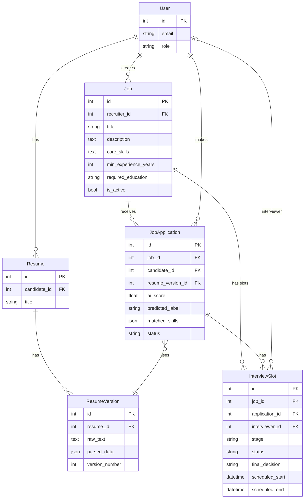

# Database Design — Match Analytics Component (Member 6)

Well-structured database design for the **Match Analytics** module: job–resume match computation (skills, experience, education) and required/matched/missing skills breakdown.

---

## ER Diagram

Entities and relationships for Match Analytics and Interview (Member 6 scope).

**Image:** [docs/images/member6-er-diagram.png](images/member6-er-diagram.png)  
**Mermaid source:** Paste the code below into [Mermaid Live](https://mermaid.live) to export a high-quality PNG/SVG.



---

## 1. Scope

This design covers only the **tables, relationships, and fields** used by the Match Analytics component. Other apps (e.g. Authentication, Career Hub) are out of scope.

---

## 2. Tables and Field Definitions

### 2.1 Job (`job_management_job`)

Stores job postings. Match Analytics **reads** structured criteria to compare against the candidate’s resume.

| Field | Type | Nullable | Description |
|-------|------|----------|-------------|
| `id` | PK (auto) | No | Primary key. |
| `recruiter_id` | FK → User | No | Owner of the job. |
| `title` | VARCHAR(255) | No | Job title. |
| `description` | TEXT | No | Full job description. |
| `requirements` | TEXT | Yes | Free-text requirements (fallback for skill extraction). |
| **`core_skills`** | TEXT | Yes | **Comma/line-separated core skills** (e.g. Python, SQL, Docker). Primary source for required-skills list in match. |
| **`min_experience_years`** | INTEGER (unsigned) | Yes | **Minimum years of experience** expected. Used for experience match %. |
| **`required_education`** | VARCHAR(255) | Yes | **Target education level** (e.g. BTech CSE, MSc). Used for education match %. |
| `application_deadline` | DATE | Yes | Optional deadline. |
| `is_active` | BOOLEAN | No | Whether posting is active. |
| `created_at` | DATETIME | No | Creation time. |
| `updated_at` | DATETIME | No | Last update. |

**Design justification (Match Analytics):**

- **`core_skills`** — Structured list avoids fragile parsing of `description`/`requirements` and gives a clear, recruiter-defined set of required skills for skills-match % and missing-skills list.
- **`min_experience_years`** — Single numeric field allows direct comparison with experience extracted from the resume (e.g. “5+ years” → 5) and a simple ratio for experience match.
- **`required_education`** — Text field supports flexible phrasing (BTech, MSc, etc.) while still allowing a normalized education-level comparison for education match %.

---

### 2.2 ResumeVersion (`resume_management_resumeversion`)

Stores each version of a candidate’s resume, including text used for NLP and optional structured data. Match Analytics **reads** text and parsed data to extract skills, experience, and education.

| Field | Type | Nullable | Description |
|-------|------|----------|-------------|
| `id` | PK (auto) | No | Primary key. |
| `resume_id` | FK → Resume | No | Parent resume. |
| `version_number` | INTEGER (unsigned) | No | Version index (unique per resume). |
| `file` | FILE (path) | Yes | Original upload (PDF/DOC). |
| **`raw_text`** | TEXT | Yes | **Extracted plain text from resume.** Primary input for skill token matching and experience regex. |
| **`parsed_data`** | JSON | Yes | **Structured fields** (e.g. `education`, `education_text`). Used for education match when available. |
| `uploaded_at` | DATETIME | No | Upload time. |

**Resume** (`resume_management_resume`): `id`, `candidate_id` (FK → User), `title`, timestamps. Used only to link ResumeVersion to a candidate.

**Design justification (Match Analytics):**

- **`raw_text`** — Single text field is sufficient for normalization, tokenization, and regex-based experience extraction without duplicating logic across formats.
- **`parsed_data`** (JSON) — Allows optional structured education (and future fields) so education match can use explicit education text when present, with fallback to `raw_text`.

---

### 2.3 JobApplication (`job_management_jobapplication`)

Links a candidate’s application to a specific job and resume version. Match Analytics **reads** this to know which job and resume to compare; it can **optionally store** match outputs for display.

| Field | Type | Nullable | Description |
|-------|------|----------|-------------|
| `id` | PK (auto) | No | Primary key. |
| `job_id` | FK → Job | No | Job applied to. |
| `candidate_id` | FK → User | No | Applicant. |
| `resume_version_id` | FK → ResumeVersion | No | **Resume version used for this application.** Ensures match is computed on the same version the candidate submitted. |
| `status` | VARCHAR(20) | No | APPLIED, SHORTLISTED, REJECTED, WITHDRAWN. |
| `ai_score` | FLOAT | Yes | Score from ranking pipeline (other member). |
| `ai_rank` | INTEGER (unsigned) | Yes | Rank among applicants (other member). |
| `predicted_label` | VARCHAR(32) | Yes | e.g. RECOMMENDED / NOT_RECOMMENDED (other member). |
| **`matched_skills`** | JSON | Yes | **List of matched skill strings.** Can be persisted from Match Analytics for “matched skills” display without recomputing every time. |
| `created_at` | DATETIME | No | Application time. |
| `updated_at` | DATETIME | No | Last update. |

**Design justification (Match Analytics):**

- **`resume_version_id`** — Explicit link to one ResumeVersion ensures match is always computed against the exact resume submitted for that application (audit trail and consistency).
- **`matched_skills`** (JSON) — Optional cache of matched skills list; supports UI (e.g. “matched vs missing”) and avoids recomputation when not needed. Match Analytics can compute on-the-fly if this is null.

**Constraint:** `UNIQUE (job_id, candidate_id)` — One application per candidate per job; match is defined per application.

---

## 3. Relationships (Relevant to Match Analytics)

```
User (recruiter)  ──1:N──►  Job
User (candidate) ──1:N──►  Resume  ──1:N──►  ResumeVersion
Job               ──1:N──►  JobApplication  ◄──N:1──  User (candidate)
JobApplication    ──N:1──►  ResumeVersion
```

- **Job → JobApplication (1:N)** — One job has many applications; Match Analytics is invoked per (job, application) and thus per (job, resume_version).
- **JobApplication → ResumeVersion (N:1)** — Each application is tied to one resume version; Match Analytics reads `Job` (criteria) and `ResumeVersion` (raw_text, parsed_data) via this link.
- **JobApplication → Job (N:1)** — Provides access to `core_skills`, `min_experience_years`, and `required_education` for the match computation.

No additional tables are required for Match Analytics; the component uses existing entities and avoids redundant storage of derived metrics when on-the-fly computation is acceptable.

---

## 4. Alignment with System Requirements

| Requirement | How the design supports it |
|-------------|----------------------------|
| **Candidate “View AI match”** | Match is computed from `Job` (core_skills, min_experience_years, required_education) and `ResumeVersion` (raw_text, parsed_data) linked by `JobApplication.resume_version_id`. API returns overall %, skills/experience/education breakdown, and required/matched/missing skills. |
| **Recruiter job form** | Recruiter supplies `core_skills`, `min_experience_years`, and `required_education` when creating/editing a job; these fields are the single source of truth for match criteria. |
| **Correct resume per application** | `JobApplication.resume_version_id` ensures the resume used for match is the one submitted for that application. |
| **Optional persistence of match details** | `JobApplication.matched_skills` (JSON) can store matched skills for display without recomputing; design keeps Match Analytics stateless while allowing optional caching. |

---

## 5. Summary

- **Tables used:** Job, Resume, ResumeVersion, JobApplication (and User for candidate/recruiter identity).
- **Key fields for Match Analytics:** Job: `core_skills`, `min_experience_years`, `required_education`; ResumeVersion: `raw_text`, `parsed_data`; JobApplication: `resume_version_id`, optional `matched_skills`.
- **Relationships:** Job ↔ JobApplication ↔ ResumeVersion provide a clear path from job criteria to the exact resume version used for each application.
- **Design decisions** are justified by clarity of criteria (structured job fields), consistency of input (one resume version per application), and alignment with system requirements (candidate match view, recruiter-defined criteria, optional caching).
