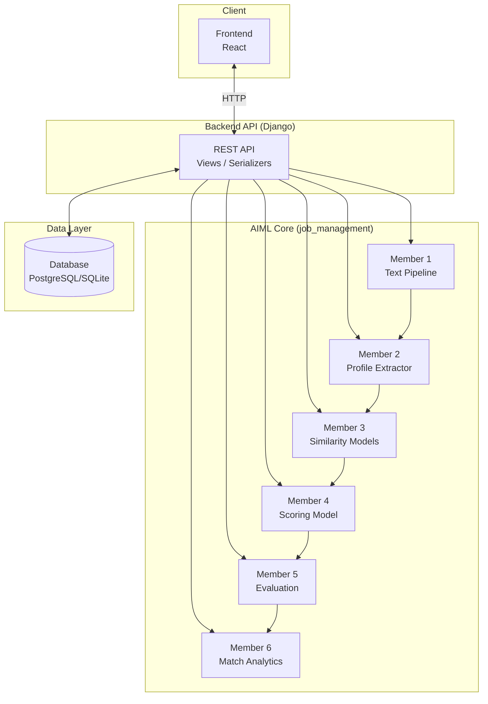
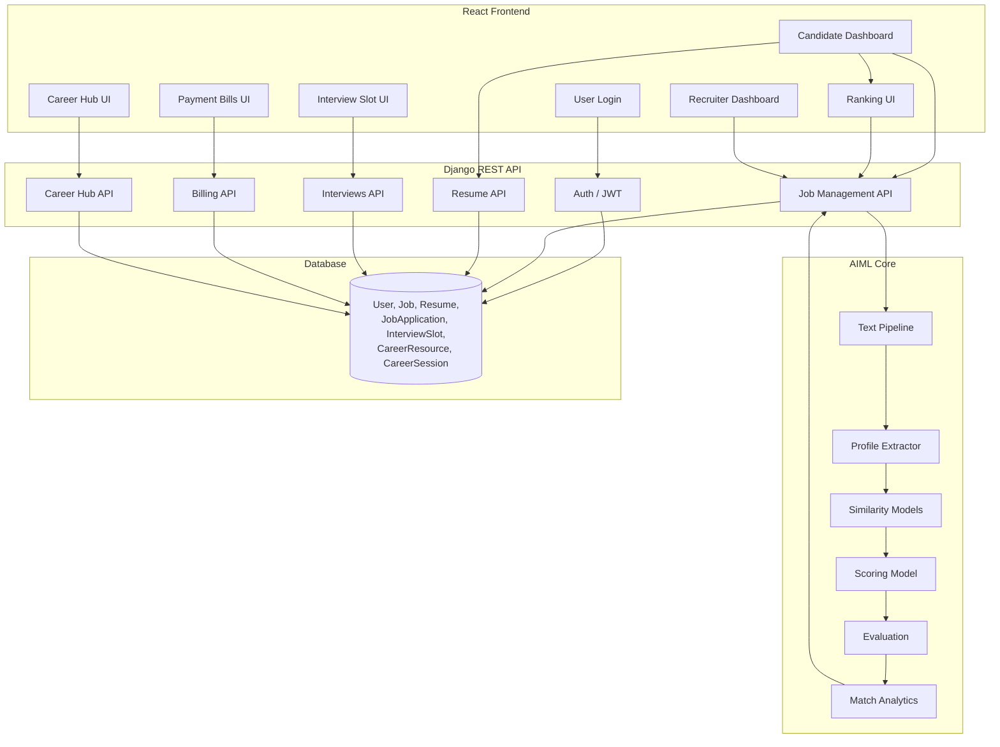
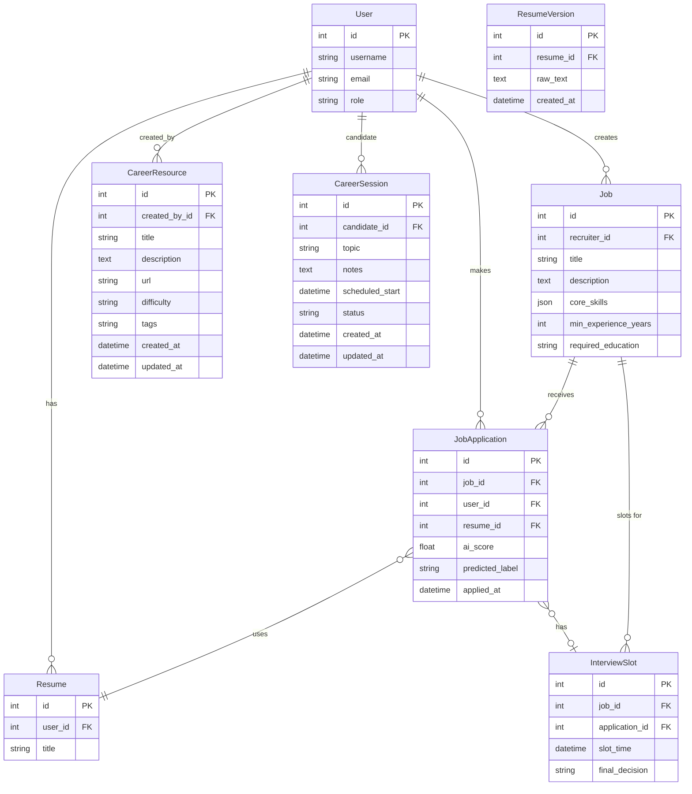
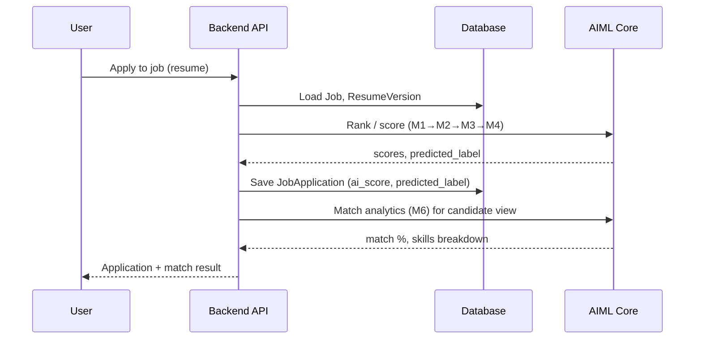

# System Diagram & Database Design

Simple, high-level view of the AIML Recruitment Platform and how each member’s work ties to the database.

---

## Generated images

| Diagram | File |
|--------|------|
| **System diagram (proper)** | [docs/images/system-diagram-proper.png](images/system-diagram-proper.png) |
| System architecture (simple) | [docs/images/system-diagram.png](images/system-diagram.png) |
| System architecture (complex, colorful) | [docs/images/system-diagram-complex.png](images/system-diagram-complex.png) |
| Database design (incl. Career Hub) | [docs/images/database-design.png](images/database-design.png) |
| Data flow (sequence) | [docs/images/data-flow.png](images/data-flow.png) |

---

## 1. System Diagram (High-Level)

### 1a. Simple version

### 1b. Full system diagram (React UI + Backend + AIML + DB)

This is a **proper system diagram**: copy the code below into [Mermaid Live](https://mermaid.live) or use VS Code’s Mermaid extension, then export to PNG/SVG for reports/slides.

**Flow (simplified):**  
React (Login, Dashboards, Interview Slot, Bills, Ranking, Career Hub) → Django REST API → AIML pipeline → API ↔ Database.

---

## 2. Database Design (Core Tables + Career Hub)

**Career Hub:** `CareerResource` = learning resources (articles, links) created by admins; `CareerSession` = candidate career coaching/mentoring sessions (topic, scheduled time, status).

---

## 3. Database Design Per Member Contribution

Each member’s **read/write** touch points (tables and main fields). Kept minimal for clarity.

| Member | Role | Reads | Writes |
|--------|------|-------|--------|
| **1** | Text pipeline | `ResumeVersion.raw_text`, `Job.description` | — |
| **2** | Profile extractor | Same text as M1 (in memory) | — |
| **3** | Similarity | Job text, resume text (from M1/M2) | — |
| **4** | Scoring model | Same + `JobApplication` (for training) | `JobApplication.ai_score`, `JobApplication.predicted_label` |
| **5** | Evaluation | `JobApplication.predicted_label`, labels (for metrics) | — (gating uses `predicted_label`) |
| **6** | Match analytics | `Job` (core_skills, min_experience_years, required_education), `ResumeVersion.raw_text`, `JobApplication` | — |

---

### 3.1 Member 1 — Text pipeline

- **Reads:** `ResumeVersion.raw_text`, `Job.description` (via ranking/analytics).
- **Writes:** None (only transforms text in memory).
- **Purpose:** Normalize and split text before feature extraction and similarity.

---

### 3.2 Member 2 — Profile extractor

- **Reads:** Normalized/split text provided by caller (from M1 + DB).
- **Writes:** None.
- **Purpose:** Extract skills and experience years from text for similarity and scoring.

---

### 3.3 Member 3 — Similarity models

- **Reads:** Job text and resume text (already loaded by ranking/analytics from `Job`, `ResumeVersion`).
- **Writes:** None.
- **Purpose:** TF-IDF + cosine similarity between job and resume.

---

### 3.4 Member 4 — Scoring model

- **Reads:** Features from M1–M3; for training, existing `JobApplication` records (scores/labels).
- **Writes:** `JobApplication.ai_score`, `JobApplication.predicted_label`.
- **Purpose:** Train/evaluate classifier; assign score and RECOMMENDED / NOT_RECOMMENDED.

---

### 3.5 Member 5 — Evaluation

- **Reads:** `JobApplication.predicted_label` (and ground truth when available).
- **Writes:** None (evaluation metrics and gating logic only).
- **Purpose:** Precision, recall, F1, threshold selection; interview gating uses `predicted_label`.

---

### 3.6 Member 6 — Match analytics

- **Reads:**  
  - `Job`: `core_skills`, `min_experience_years`, `required_education`.  
  - `ResumeVersion.raw_text` (for skills/experience/education).  
  - `JobApplication` (for match result storage/display).
- **Writes:** None (match % and breakdown are computed and returned via API).
- **Purpose:** Job–resume match % (skills, experience, education) and required/matched/missing skills.

---

## 4. Data Flow (End-to-End)

---

You can open this file in any editor or viewer that supports Mermaid (e.g. VS Code with a Mermaid extension, or GitHub) to see the diagrams. Export to PNG/SVG from there if needed for reports or slides.
